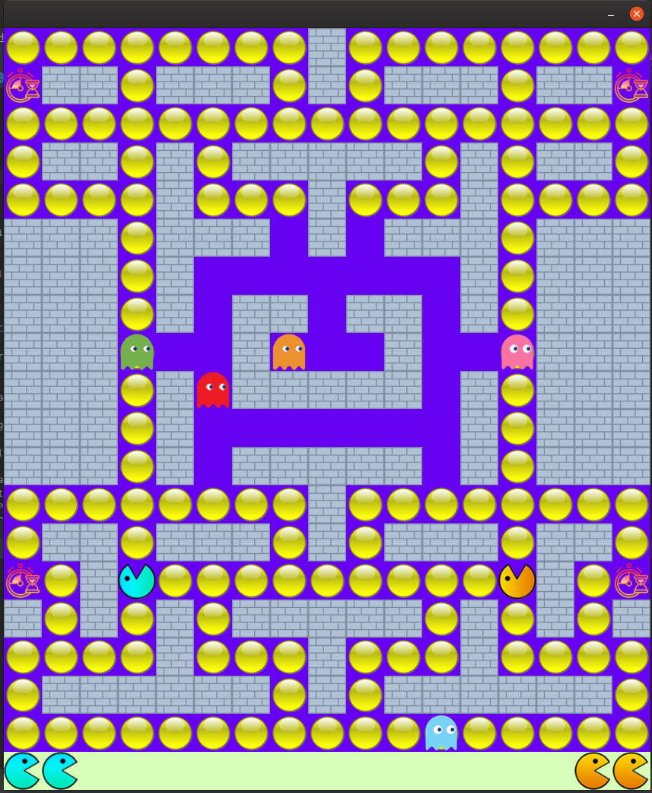
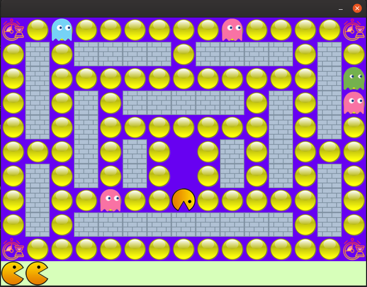

# PacMan

Second Project of advanced programming course at KNTU.

This is a simple pacman game developed using java and javaFX.

Depending on your version of JRE you might have to configure javaFX additionally to run the game.

## Features

- Four Game modes (Single Player - Single Player with cooperative AI - Two Player cooperative - Two Player competitive)
- Five Ghost Types (Vertically Random, Horizontally Random, All directions Random, Greedy and Smart (searches for pacman using A*))
- Four Map patterns
- Clock in Maps to freeze ghosts for five cycles
- Showing remaining lives
- Saving and Loading game
- Three Difficulty levels
- Game Over Screen with ability to play again without closing the game.

------

### Instructions

The GUI is pretty self explanatory and guides you throw. This part is just for explaining input keys.

In all of the game modes 'P' or Space key will pause the game. Pressing them again will resume your game. While game is paused you can save it using 'S' key. Saving will rewrite your last save so if you want your last save, save the SaveFile.ser in another place for later use.

In all both single player modes pacman is controlled using arrow keys.

In Two Player modes left player controls his pacman using **WASD keys** and right player using **arrow keys**.

Amir Mirzaei - <amir.mirzaei1379@gmail.com>

Another example of game. (Single Player - Map 1 - Easy mode)

## Projects Details

https://docs.google.com/document/d/1iaGckF14AplW4Bfk3PgJ0iBmZtEjCeJKw_0qwW_lYzg/edit
-------------------------------------------------------------------------------------------------------------------------
<a target="_blank" href="/icons/set/clock">Clock icon</a> icon by <a target="_blank" href="https://icons8.com">Icons8</a>

<a target="_blank" href="/icons/set/brick-wall">Brick Wall icon</a> icon by <a target="_blank" href="https://icons8.com">Icons8</a>
